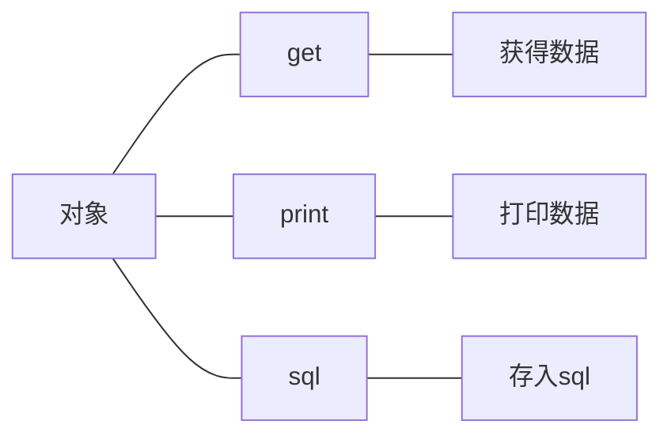

# -2025年实习写的代码
收集了2025年实习的时候写的所有代码，主要面向sql和python

## MySqlHelper
简化了python和sql之间的交互
最大的特色是增加了一个快速查询的功能，考虑到我们在python中写sql语句时不会有提示出现，导致书写比较麻烦，增加了一个符合python风格的查询接口
可以通过传入列表或者字符串直接拼接sql语句
### 接口介绍
首先使用MySqlHelper类创建一个对象，执行connect用于连接数据库
```python
db = MySqlHelper(
        host="",
        user='',
        password="",
        database="",
    )

    db.connect()
```
然后就可以调用下面的接口:
1. execute_query:执行查询操作，返回多条记录
2. execute_single:执行查询操作，返回单条记录
3. execute_update:执行INSERT/UPDATE/DELETE操作
4. execute_many:批量执行相同SQL语句
5. execute_quick:可以不写SQL语句,快速查找需要的数据,不支持太复杂的逻辑
6. get_table_columns:获取表的列名列表
7. table_exists:检查表是否存在

### 使用案例：（如果想要测试下面的代码，可以使用仓库中的sql文件创建一个学生信息表）
**1. 连接数据库**
```python
db = MySqlHelper(
        host="localhost",
        user='root',
        password="",
        database="Student_Information",
    )

    db.connect()
```
**2. 执行批量插入**
```python
sql = "INSERT INTO Student (studentName, studentNo, height) VALUES (%s, %s, %s)"
    params_list = [
    ('张三', '0000000001', 175.6),
    ('李四', '0000000002', 180),
    ('王五', '0000000003', 169)
    ]
    count = db.execute_many(sql, params_list)
```
**3. 执行查询**
```python
sql = "SELECT studentName, height FROM Student WHERE height<170 "
    res = db.execute_query(sql)
    print(res)
```
**4. 执行简单查询**
```python
sql = "SELECT studentName, height FROM Student WHERE height<170 "
    res = db.execute_query(sql)
    print(res)
```
**5. 执行大量插入**
```python
data = [
        (1, '习近平向美国匹克球访华团回复口信', '7904198'),
        (2, '地震频发 日本第二批岛民撤离避难', '7808045'),
        (3, '郭晶晶问为何叫山东舰 权威解答来了', '7713698'),
        (4, '热浪来袭 如何做好防护', '7618736'),
        (5, '壶口瀑布再现50元人民币上的壮阔', '7522211')
        ]
db.execute_insert_list('News',['item_rank','titles','hot_index'],data)
```

## 百度爬虫
爬取了百度热搜的前十，并且通过接口存入数据库
既可以插入，也可以更新覆盖原本的记录

## Crawler
集成了豆瓣和百度的爬虫，创建对象，然后使用函数获取网站信息，并提供直接将数据插入mysql的函数接口（要求使用mysql表格指定的列名）

**百度热搜爬虫**
```python
baidu = BaiduCrawler()
baidu.get_top10()
baidu.print_news()
baidu.save_to_sql(
        table='News',
        host="localhost",
        user='root',
        password="",
        database="online_information",
    )
```
**豆瓣电影top100爬虫**
```python
douban = DoubanCrawler()
douban.get_top_100()
douban.print_film()
douban.save_to_sql(
        table='Films',
        host="localhost",
        user='root',
        password="",
        database="online_information",
    )
```
